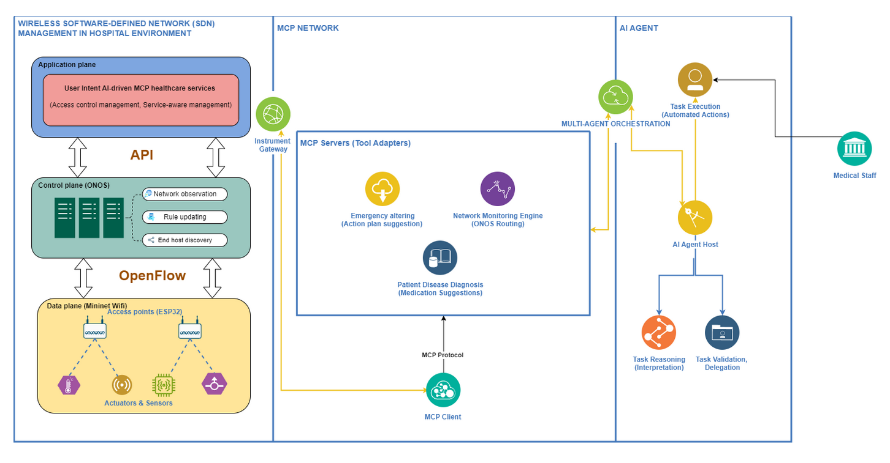

# LLM-Based Intent Orchestration for Medical IoT Environments

## Overview

Modern medical research laboratories increasingly integrate smart workspace environments with diverse IoT devices and services. However, clinicians, nurses, and researchers—typically non-IT specialists—require intuitive mechanisms to express their operational intents without manual device configuration. LLMs offer promising capabilities in reasoning, planning, and task orchestration, enabling seamless automation of data retrieval, analysis, and workflow execution. More details in [CICT Hackathon Presentation]()



## Application Scenarios

### Scenario 1: In-Hospital Clinical Decision Support
AI-assisted diagnostic recommendations leveraging historical and real-time patient records from sensor/actuator data collection systems. Healthcare professionals retain final decision authority to validate and correct potential errors.

**Key QoS Metric:** *Reliability* — Minimal packet loss is critical to prevent misdiagnosis; moderate latency is acceptable for non-real-time consultation workflows.

### Scenario 2: Real-Time Physiological Monitoring
Wearable and implantable sensors continuously monitor vital signs (blood pressure, heart rate) with anomaly detection and immediate caregiver alerts.

**Key QoS Metric:** *Ultra-low Latency* — Immediate response is essential for medical emergencies; periodic data redundancy tolerates minor packet loss.

**Research Direction:** Edge-based lightweight patient prediction models running directly on sensor devices.

### Scenario 3: Smart Hospital BioIOT Management 
Camera-based monitoring systems detect resident falls, autonomous medical IOT sensors/actuators management, enhancing safety, performance, energy-awareness while reducing staff workload.

**Key QoS Metrics:** *Bandwidth & Jitter* — High bandwidth ensures video quality; low jitter maintains interpretable video streams.

---

## Quick Setup

### Prerequisites
- Install pipx: [github.com/pypa/pipx](https://github.com/pypa/pipx)
- Install Poetry: [python-poetry.org/docs](https://python-poetry.org/docs)

### Installation
```bash
# Verify Poetry installation
poetry --version

# Install dependencies
poetry install --no-root

# Check virtual environment
poetry env list

# Activate environment (Poetry 2.x)
source $(poetry env info --path)/bin/activate

# Or for Poetry 1.x
poetry shell

# Install FastMCP protocol
pip install fastmcp

```

---

## Project Structure

```
llm-intent-orchestration/
├── src/
│   ├── main.py              # CLI entry point in FastMCP server with menu interface
│   ├── crew.py              # Multi-agent orchestration
│   ├── agents/
│   │   └── agents.py        # LLM Agent logic (Gemini LLM)
│   └── tasks/               # Task router 
├── configs/                 # Configuration files
├── tests/                   # Unit tests
├── docs/                    # Documentation
├── tools/                   # Tools
├── data/                    # Data
└── .env                     # Environment variables (GEMINI_API_KEY)
```

### Running the Application

```bash
# CLI Menu
python src/main.py
```

---

## References

1. MCP SDK Integration: [modelcontextprotocol.io/docs/sdk](https://modelcontextprotocol.io/docs/sdk)
2. CrewAI Task Automation: [docs.crewai.com/en/mcp/overview](https://docs.crewai.com/en/mcp/overview)
3. CrewAI Tutorial: [youtu.be/sPzc6hMg7So](https://www.youtube.com/watch?v=sPzc6hMg7So)
4. MCP Learning Resources: [youtu.be/QIOk4XZ5XNU](https://youtu.be/QIOk4XZ5XNU)
5. CrewAI + FastMCP: [github.com/ashishpatel26/Crewai-MCP-Course](https://github.com/ashishpatel26/Crewai-MCP-Course)
6. Integration with FastMCP via [langchain-mcp-adapters](https://github.com/langchain-ai/langchain-mcp-adapters)
7. ONOS MCP Server (Code inspiration):[onos-mcp-server](https://github.com/MCP-Mirror/davidlin2k_onos-mcp-server)
## Future Work
1. Giang task
- Edge AI deployment for resource-constrained devices [Edge AI and IoT in 2025](https://www.youtube.com/watch?v=P54zzvqnVLk&t=874s)

2. Trang task 
- Data field (data files) & LLM Agent Workflow discussion with professor Hamidi.