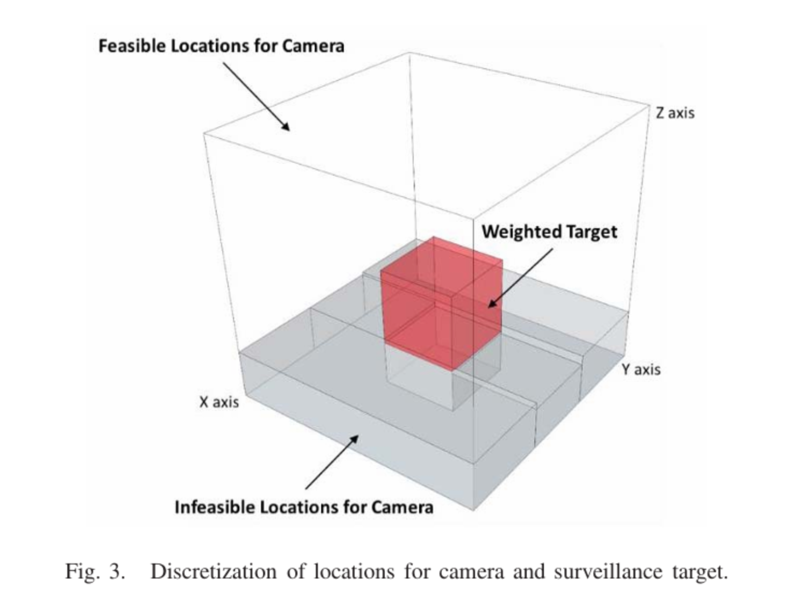

# Plan Validation Agent Algorithm for Sensor Control (Section 1.4)
## Naive Sensor Activation (Baseline - Section 1.4.1)

- Objective: Ensure continuous monitoring of the environment by keeping all sensor nodes fully active, without prioritization or contextual awareness. This baseline is used as a reference for evaluating optimized strategies.
- Assumptions: Linear corridor deployment; each device has a motion sensor and ESP32 camera; fixed local coverage; no prediction/optimization.
- Algorithm:
  - All devices in a 3D space are activated simultaneously.
  - Motion sensors continuously monitor their respective areas.
  - Each device is a sensor node (no camera), capable of motion/activity/environmental sensing (signal, noise, camera, etc.)
  - Devices and services remain active indefinitely, regardless of activity level.

Pseudocode

```text
INPUT:
- S = dataset records
- D(t) = set of nodes available at timestamp t

FOR each timestamp t in S:
    FOR each node di in D(t):
        activate(di)
        enable_monitoring(di)
        request_service(di)     // simulated continuous sensor service activation
```

Limitations:
- Extremely high energy consumption due to permanent activation of all sensors and cameras
- Redundant data transmission in low-activity regions
- No adaptation to patient behavior or environmental context
- Poor scalability as the number of devices increases (WSN deployments)

## Cellulaire Sequential Clustering Zone-based Activation (Section 1.4.2)

- Objective: Ensure monitoring coverage by activating nodes sequentially across space, reducing simultaneous energy usage [9].
- Assumptions: Nodes are distributed in 3D space and ordered spatially (clustering in zone-based environment), each has sensing capability, communication module and fixed activation time window with no prediction or learning.
- Algorithm:
  -Partition space or order nodes (clusters in zone)
  - Activate nodes cluster-by-cluster
  - Each node senses for a fixed duration, transmits only if event detected then deactivate and move to next.

Pseudocode:

```text
INPUT:
- D = {d1, d2, ..., dn}  // sensor nodes
- T_active = fixed activation duration

// Preprocessing: spatial ordering
L = spatial_ordering(D)  // zone scan

LOOP:
  FOR each node di in L:
      activate(di)
      start timer T_active

      WHILE timer not expired:
          data = sense(di)

          IF event_detected(data):
              transmit(di, data)

      deactivate(di)
```

Limitations:
- High energy consumption (nodes activated even when unnecessary)
- No awareness of patient behavior patterns or event probability.
- Fixed activation time (not adaptive)
- Poor scalability in dense or large-scale 3D deployments

## Probabilistic & Spatially Optimized Activation (Energy efficiency - Section 1.3.3)



- Objective: Minimize energy by activating only necessary devices using the probability γ of patient egress [1] and spatial coverage (x, y, z, r) [7] using Python library.
- Concepts:
  - Patient movement probability γ ∈ [0, 1] derived from time-of-day, history, medical context.
  - Device model: di = (xi, yi, zi, ri) with sensing radius ri.
  - Coverage optimization: select the minimal subset of devices covering the predicted “risk zone”.
- Risk Zone: R(γ) = R_min + γ × (R_max − R_min)
- Behavior:
  - Higher γ → larger risk radius, more aggressive monitoring; lower γ → smaller radius, fewer devices.

Pseudocode:

```text
INPUT:
- D = {d1, d2, ..., dn}              // all sensor nodes
- Target position P(xp, yp, zp)
- Gamma parameters k, θ
- Current time t
- R_min, R_max
- T_base

// Step 0: Compute temporal probability using Gamma distribution
γ(t) = GammaCDF(t; k, θ)

// Step 1: Compute dynamic risk zone
R = R_min + γ(t) * (R_max - R_min)
RiskZone = sphere(center = P, radius = R)

// Step 2: Candidate selection (spatial filtering)
C = {}
FOR each sensor di in D:
    IF distance(di, P) <= R:
        add di to C

// Step 3: Compute heuristic score for each candidate
FOR each sensor di in C:
    score(di) = α * Energy(di)
              + β * Accuracy(di)
              + γs * Signal(di)
              - δ * Noise(di)

// Step 4: Heuristic coverage optimization
A = {}
U = uncovered area of RiskZone

WHILE U is not empty:
    select sensor dj in C \ A with highest utility
        utility(dj) = coverage_gain(dj, U) * score(dj)
    add dj to A
    update U by removing area covered by dj

// Step 5: Activation
FOR each sensor di in A:
    activate(di)
    data = sense(di)

    IF event_detected(data):
        transmit(di, data)

// Step 6: Adaptive duration
wait(T_base * γ(t))

// Step 7: Deactivation
FOR each sensor di in A:
    deactivate(di)
```

Notes:
- A can be approximated with greedy disk-cover (pick device covering most uncovered area iteratively).
- T_base × γ provides adaptive activation duration (longer when risk is higher).
- Suitable for real-time updates: recompute γ and A on sliding windows.

Further Explanation (Principal Concept): Gamma-based temporal prediction with heuristic spatial optimization for energy-efficient sensor activation. First, the event probability  γ(t) is estimated using the cumulative distribution function of a Gamma distribution, enabling adaptive adjustment of the monitoring radius. Next, only spatially relevant sensors are retained as candidates. Each candidate is assigned a heuristic score based on residual energy, detection accuracy, signal strength, and noise level. A greedy cover heuristic is then applied to iteratively select the subset of sensors that maximizes coverage of the dynamic risk zone while prioritizing high-quality nodes. Finally, the selected sensors are activated for an adaptive duration proportional to γ(t), after which they are deactivated to conserve energy.

- Time Optimization (Gamma Distribution): In the base of Poisson distribution inspiration of patient movements in hospital corridors (leaving and returning to rooms) are random and independent events but in total the distribution is possibly calculated and predicted thanks to probabilistic distribution. However, Poisson models **event counts** (\(N(t)\): number of movements in time interval \(t\)), not **event timing**, it assumes a constant average movement rate \(\lambda\), which totally unsuitable for **real-time sensor activation** (for example, patient motion detection in 8 AM equal to 9PM). In a Poisson process, inter-event time follows an **exponential distribution**. However, exponential distributions are memoryless, too simplistic for human behavior. To better model patient behavior, we use a **Gamma distribution** for the waiting time \(T\) until patient exits the room, meaning motion occurs \(T \sim \text{Gamma}(k, \theta)\), Where \(k\) (shape) is the regularity of behavior and \(\theta\) (scale) is the average waiting duration. The motion probability increases over time and is used to decide **when and how many devices to activate**. 

- Space Optimization (Meta-heuristic algorithm): In the context of spatial 3-D space coverage motion device for activity maximization under Smart Cities environment[2], meta-heuristic algorithms have demonstrated the ability to maximize coverage while adhering to resource constraints, such as budget limits. Translating this principle to our motion-sensing and camera-based monitoring system, the “budget” corresponds to energy consumption, which must be minimized while ensuring adequate coverage of potential patient movements. By leveraging camera coverage and strategic placement, we can implement a collaboration-based local search algorithm, which combines local search optimization with coordinated allocation among multiple devices. This approach allows the system to dynamically select the minimal subset of devices that collectively cover the predicted “risk zone” of patient activity. Consequently, the algorithm reduces redundant activations, ensures all critical areas are monitored, and optimizes energy usage by activating only those devices that are necessary at a given moment, thereby balancing coverage effectiveness and energy efficiency. 

---

## 2. References

[1] Python Gamma Probabilistic Algorithm Library: https://pythonguides.com/python-scipy-gamma/

[2] Camera Placement in Smart Cities for Maximizing Weighted Coverage With Budget Limit. IEEE Sensors Journal. Available: https://ieeexplore.ieee.org/abstract/document/7968252

[3] Hidden Markov Model-Based Fall Detection With Motion Sensor Orientation Calibration: A Case for Real-Life Home Monitoring. IEEE Journal of Biomedical and Health Informatics. Available: https://ieeexplore.ieee.org/abstract/document/8171718

[4] Orientation Optimization for Full-View Coverage Using Rotatable Camera Sensors. IEEE Internet of Things Journal. Available: https://ieeexplore.ieee.org/abstract/document/8824113

[5] Gamma-modulated Wavelet model for Internet of Things traffic. 2017 IEEE International Conference on Communications (ICC). Available: https://ieeexplore.ieee.org/abstract/document/7996506

[6] Camera Planning for Physical Safety of Outdoor Electronic Devices: Perspective and Analysis. IEEE/CAA Journal of Automatica Sinica. Available: https://ieeexplore.ieee.org/abstract/document/10916675

[7] Meta-heuristic ALgorithms in Python: https://mealpy.readthedocs.io/en/latest/pages/general/introduction.html

[8] Energy consumption in Wireless Sensor Environment: https://www.kaggle.com/datasets/ziya07/wireless-sensor-network-dataset

[9] Cellular Networks - Introduction to Wireless Networks. Available: https://www.slideserve.com/zeph-hill/introduction-to-wireless-networks