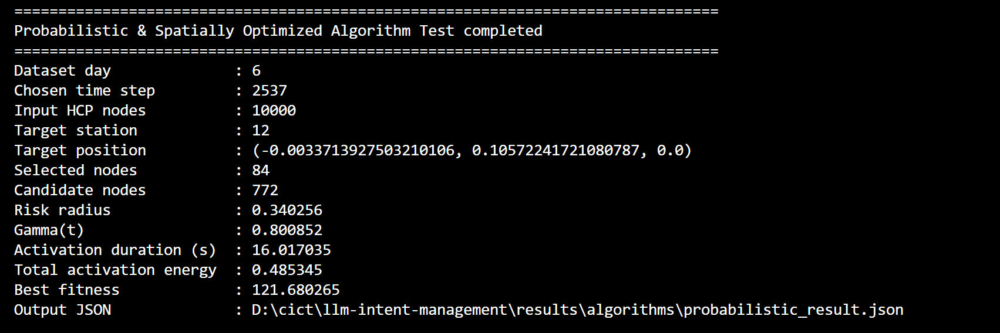

# Sensor Activation Algorithm Tests

## Overview

Tests 3 main algorithms (naive, cellulaire, probabilistics) with sensor nodes and hospital-movement HCP location data (risk zones).
> [!TIPS]
> View the output JSON at `results/algorithms/probabilistic_result.json` for detailed metrics and activation plans.

## Quick Start

### Naive Algorithm (Baseline - Section 1.4.1)

```bash
python src/test/naive.py --data-root data --seed 42
```

**Options:**
- `--data-root DATA_ROOT` - Root folder (default: `data`)
- `--seed SEED` - Random seed (default: `42`)
- `--output-json OUTPUT_JSON` - Output path (default: `results/algorithms/naive_result.json`)

### Cellulaire Algorithm (Zone-based - Section 1.4.2)

```bash
python src/test/cellulaire.py --data-root data --zone-radius 0.2 --activation-duration 300 --seed 42
```

**Options:**
- `--data-root DATA_ROOT` - Root folder (default: `data`)
- `--zone-radius ZONE_RADIUS` - Zone radius in latent units (default: `0.2`)
- `--activation-duration ACTIVATION_DURATION` - Seconds per zone (default: `300`)
- `--seed SEED` - Random seed (default: `42`)
- `--output-json OUTPUT_JSON` - Output path (default: `results/algorithms/cellulaire_result.json`)

### Probabilistic Algorithm (Optimized - Section 1.4.3)

```bash
python src/test/probabilistic.py --data-root data --day 2 --target-mode hcp-centroid --seed 42
```

**Options:**
- `--data-root DATA_ROOT` - Root folder (default: `data`)
- `--day {2,6,7,8,9,10}` - Hospital movement day (default: `2`)
- `--time-step TIME_STEP` - Specific HCP time slice (auto-selects busiest)
- `--target-mode {hcp-centroid,station}` - Risk-zone source (default: `hcp-centroid`)
- `--station STATION` - Station ID for station mode (default: `12`)
- `--r-min R_MIN` - Min risk radius in latent units (default: `0.10`)
- `--r-max R_MAX` - Max risk radius in latent units (default: `0.40`)
- `--sensing-radius SENSING_RADIUS` - Sensor coverage radius (default: `0.18`)
- `--gamma-shape GAMMA_SHAPE` - Gamma distribution shape (default: `2.0`)
- `--gamma-scale GAMMA_SCALE` - Gamma distribution scale (default: `10.0`)
- `--num-risk-points NUM_RISK_POINTS` - Sampled points for coverage (default: `120`)
- `--epoch EPOCH` - GA epochs (default: `100`)
- `--pop-size POP_SIZE` - GA population size (default: `30`)
- `--seed SEED` - Random seed (default: `42`)
- `--output-json OUTPUT_JSON` - Output path (default: `results/algorithms/probabilistic_result.json`)


## Results

Output JSONs are saved to `results/algorithms/`:
- `naive_result.json` - Naive algorithm results
- `cellulaire_result.json` - Cellulaire algorithm results  
- `probabilistic_result.json` - Probabilistic algorithm results
> Note: Probabilistic algorithm (Section 1.3.3 - Examples)


